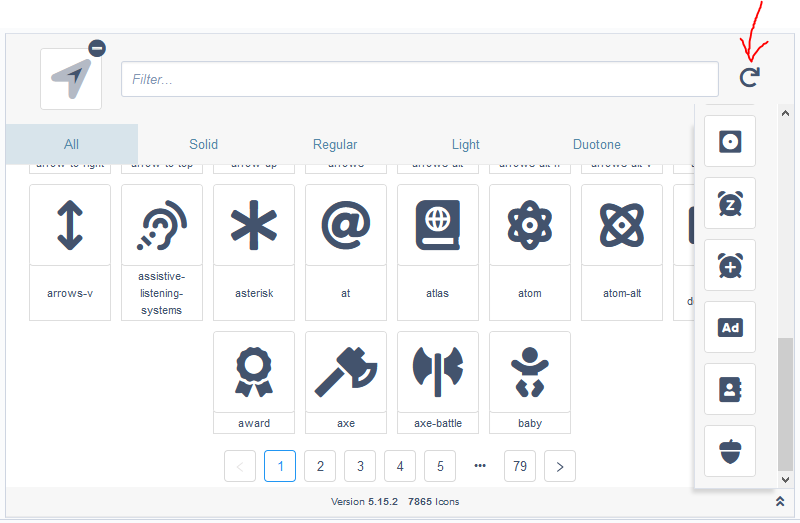

# Font Awesome Icon Picker

Adds a Font Awesome 5 icon picker to SilverStripe 4.
This comes bundled with the free version of Fontawesome 5.15.2.
This will work with Fontawesome 5.15.2 pro out-of-the-box (but does not come bundled with it).

**With the Free version of Font Awesome**


**With the Pro version of Font Awesome**


**Smaller starting size!**
The Font Awesome Icon Picker field is now much smaller to start out with.
It can be expanded to show the list of icons, search, and icon type selector.


**NEW Recently used icon list!**
By clicking the button in the screenshot below, it will open a recently used dropdown list.
This list carries over between fields, so you can quickly select icons that you recently used.



## Requirements

-   SilverStripe 4.x

## Installation

Installation is supported via composer only

```sh
composer require buckleshusky/fontawesomeiconpicker
```

-   Run `dev/build?flush=all` to regenerate the manifest

## Usage

Simply add the field to a DataObject or Page like you normally would.
This will save the Font Awesome Icon's class info to a dbfield for use on the front end.

```php

use BucklesHusky\FontAwesomeIconPicker\Forms\FAPickerField;
use SilverStripe\ORM\DataObject;

class TestDataObject extends DataObject
{

    private static $table_name = "TestDataObject";

    private static $db = [
        'FAIcon' => 'Varchar(100)',
    ];

    public function getCMSFields()
    {
        $fields = parent::getCMSFields();

        $fields->addFieldToTab(
            'Root.Main',
            FAPickerField::create('FAIcon', 'Font Awesome Icon\'s Name')
        );

        return $fields;
    }
}
```

### Notes

This has not been tested for use on the frontend of a site.

### Settings

**Enable Font Awesome Pro**
To enable Font Awesome Pro, add this to your yml file. Replace `all.min.css` with the Font Awesome Pro css name.

```yml
FontawesomeIcons:
    unlock_pro_mode: true
    css: "all.min.css"
```

**Adding your own icons:**
To add your own icons from another (css) icon set, you can add this to your yml file:

```yml
FontawesomeIcons:
    extra_requirements_css:
        - "themes/{your theme}/css/iconpack.css"
        - "themes/{your theme}/css/inconpack2.css"
    icons:
        - "{css icon class}"
        - "{css icon class}"
```

**Removing icons:**
This only works for the built in Font Awesome icons.
Simply add this to your yml and list the icons you don't
want your users to be able to select.

```yml
FontawesomeIcons:
    remove:
        - "fas fa-ad"
        - "fas fa-air-freshener"
```

**Disabling built in Font Awesome:**
If you want to use your own icons or a version of Font Awesome that is not supported,
you can disable the built in Font Awesome. If you decide to add your own,
you will need a yml list of icons.

```yml
FontawesomeIcons:
    disable_builtin_fontawesome: true
    my_icons:
        - "new icon"
        - "new icon"
        - "new icon"
        - "new icon"
```

### What's New

-   new recent icons list
-   completely react driven
-   fontawesome pro now loads much faster
-   it now works in react sections of silverstripe (File section)
-   field is now smaller and expands to allow you to select a new icon
-   you can now remove the selected icon
-   icons are now paginated
-   list of icons sizes are now bigger
-   added tooltip to show the name of the selcted icon
