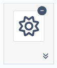
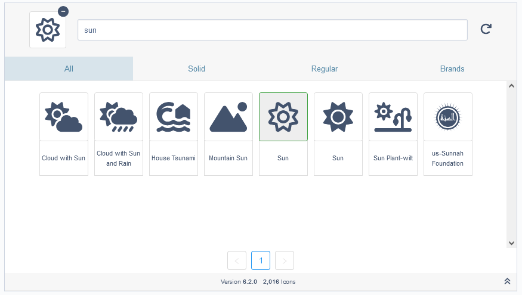

# Font Awesome Icon Picker

Adds a Font Awesome 6.x icon picker to SilverStripe 4.
This uses the CDN for Fontawesome 6.2.0.
This will work with Fontawesome 6.2.0 pro out-of-the-box (but you will need to have a copy of the kit).

### With the Free version of Font Awesome
Starts out slim:

Expands to allow you to seach for your desired icon:

A list of your recently toggled icons:


### With the Pro version of Font Awesome
Everything that you can do in the free version, you can do in the pro version. The pro version however comes with more options.

When enabled, Light and Duotone icon styles are unlocked:


Sharp icons, by default, are enabled when you switch to pro:


## Requirements

-   SilverStripe 4.x or 5.x

## Installation

Installation is supported via composer only

```sh
composer require buckleshusky/fontawesomeiconpicker
```

-   Run `dev/build?flush=all` to regenerate the manifest

## Usage

Simply add the field to a DataObject or Page like you normally would.
This will save the Font Awesome Icon's class info to a dbfield for use on the front end.

```php
use BucklesHusky\FontAwesomeIconPicker\Forms\FAPickerField;
use SilverStripe\ORM\DataObject;

class TestDataObject extends DataObject
{
    private static $table_name = "TestDataObject";

    private static $db = [
        'FAIcon' => 'Varchar(255)',
    ];

    public function getCMSFields()
    {
        $fields = parent::getCMSFields();

        $fields->addFieldToTab(
            'Root.Main',
            FAPickerField::create('FAIcon', 'Font Awesome Icon\'s Name')
        );

        return $fields;
    }
}
```


If needed, you can add the following to your `PageController` or any page controller that extends `PageController`. This can be added to the `init()` method like below:

```php
protected function init()
{
    parent::init();

    // get the requirements to render fontawesome icons
    $this->fontAwesome();
}
```

### Notes

The field has not been tested for use on the frontend of a site.

### Settings

**Enable Font Awesome Pro**
To enable Font Awesome Pro, add this to your yml file.
Replace `all.min.css` and `sharp-solid.min.css` with the Font Awesome Pro css name.
These files should be located in your theme's css folder.

```yml
# settings for FontawesomeIcons
FontawesomeIcons:
  unlock_pro_mode: true
  pro_css: 'all.min.css'
  # only use one of the following to get your sharp css
  pro_sharp_css: 'webfonts/fontawesome/css/sharp-solid.min.css' # not needed if sharp is disabled
  pro_sharp_css_folder: 'webfonts/fontawesome/css/' # not needed if sharp is disabled
```

**Options:**
| Option                     | Description                                                                                                                                                                           | Values                          | default |
|----------------------------|---------------------------------------------------------------------------------------------------------------------------------------------------------------------------------------|---------------------------------|---------|
| free_css_cdn_version       | for the **FREE version**. This is the version to get from the fontawesome CDN. This can be used to get the new version. You will still need a copy of `icon-families.yml`.            | the version to get from the CDN | 6.2.0   |
| unlock_pro_mode            | enable this to switch to **PRO version**                                                                                                                                              | true/false                      | false   |
| disable_sharp_icons        | with this enabled, the sharp icons will not be loaded. `pro_sharp_css` will also not be required.                                                                                     | true/false                      | false   |
| pro_css                    | the name of the **PRO version** css file                                                                                                                                              | string                          |         |
| pro_sharp_css              | the name of the **PRO version sharp** css file. This should be a combined css file containing the sharp-solid, sharp-regular, sharp-light. Example: ``                                | string                          |         |
| pro_sharp_css_folder       | the name of the folder that contains the css files that start with `sharp-`. Using this, it will scan through the folder and load all css files that start with `sharp-`. Example: `` | string                          |         |
|


**How to setup the PRO version of fontawesome?**
- You will need to download a kit from the [fontawesome site](https://fontawesome.com/sessions/sign-in?next=%2F).
- Grab the css file for `all.min.css` and `sharp-solid.min.css` and place it in your theme's css folder.
- Grab the `webfonts` folder and place it in your theme's folder. Example `themes\simple`.
- update your config:
    ```yml
    FontawesomeIcons:
        unlock_pro_mode: false
        # the css of all and sharp-solid
        pro_css: 'all.min.css'
        # not needed if sharp is disabled
        pro_sharp_css: 'sharp-solid.min.css'
    ```

**How do I use a newer version of Fontawesome?**
- Get a copy of `icon-families.yml`.
    - You can obtain this from their [github](https://github.com/FortAwesome/Font-Awesome/blob/6.x/metadata/icon-families.yml).
    - for pro, you will get this file when you download pro from fontawesome
- Place this file into your `app\_config` folder.
- Open the file.
- Indent everything in the file by 2 spaces and save.
- Add the following to the top of the file
```yml
---
name: my-icon-list
After: "#buckleshusky-fontawesomeiconpicker-icons"
---
FontawesomeIconsListCustom:
```
- Your file should look something like the following:
```yml
---
name: my-icon-list
After: "#buckleshusky-fontawesomeiconpicker-icons"
---
FontawesomeIconsListCustom:
  '0':
    changes:
      - 6.0.0-beta1
      - 6.2.0
    familyStylesByLicense:
      free:
[...]
```
**Note:** you can use `FontawesomeIconsList` and it will merge the two list together.

- For the **FREE version**:
    - add the following to your yml with the desired version you would like from the CDN:
    ```yml
    FontawesomeIcons:
      free_css_cdn_version: '6.3.0'
    ```
- For the **PRO version**:
    - follow the steps above for **How to setup the PRO version of fontawesome?**

### What's New

- switched to use FontawesomeIconsListCustom yml config to prevent duplicate icons
- clicking sharp now allows you to select type
- Duotone has been moved from the type bar to the family bar
- when you click a family, the type buttons are filtered down to only show you what's available
- updated documentation

### Future
- add back in removing icons
    - removed for now to clean this up and get it released
- add documentation for adding your own icons
- dynamic generating of style types
